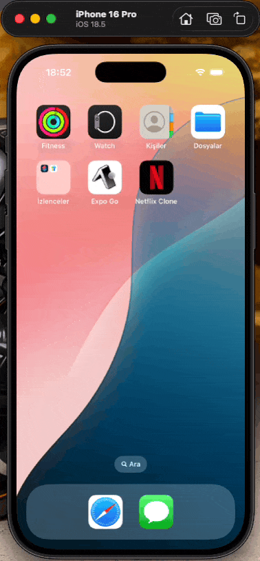

📺 Netflix Clone Mobile App
A React Native-based digital streaming platform clone offering a modern user experience. This project was developed using React 19 and React Native 0.84 architecture, focusing on high performance and a stylish UI/UX design.

# 🚀 Technologies and Tools
- Framework
- Navigation
- State Management
- Networking
- Icons
- Styling
- Language

# ✨ Features
- Dynamic Content: Real-time movie and series data via API integration.
- Advanced Navigation: Smooth transitions with tab bars and nested stack structure.
- Global State: Use of Redux Toolkit for user preferences and content lists.
- Responsive Design: Fully compatible with different screen sizes and notched (notch) phones.

# 📸 ScreenShot

